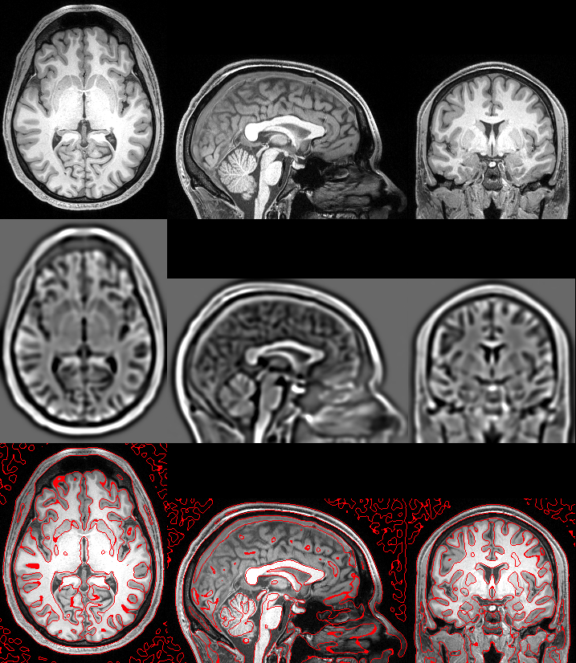

## About

This repository provides sample MRI images to evaluate the [Marr–Hildreth algorithm](https://en.wikipedia.org/wiki/Marr–Hildreth_algorithm) for edge detection. They noted that the [Difference of Gaussian](https://en.wikipedia.org/wiki/Difference_of_Gaussians) (DoG) approximates the second derivate of Gaussian (the [Laplacian of Gaussian](https://en.wikipedia.org/wiki/Blob_detection#The_Laplacian_of_Gaussian) (LoG)). The method is illustrated below. The raw image (top) is blurred with two Gaussians (here with a 2.0 and 3.2mm [FWHM](https://en.wikipedia.org/wiki/Full_width_at_half_maximum) (middle), the edges are defined as the zero-crossing of this image (bottom).



The [Canny Edge Detector](https://en.wikipedia.org/wiki/Canny_edge_detector) is superior for many 2D applications. However, DoG has several appealing characteristics for 3D medical imaging. First, the Canny method requires image brightness thresholds that are hard to define for MRI modalities where image brightness is relative. Second, the Canny edge tracking by hysteresis is difficult for 3D images (and therefore not implemented by popular tools). In contrast, the DoG uses a spatial threshold, and the size of features in the human brain are known and relatively constant. Furthermore, optimized Gaussian blurs are implemented in most neuroimaging pipelines, making the DoG edge detection simple to compute.

## Evaluation

This repository includes sample MRI scans [from a single individual](https://osf.io/kjdm3/). The included modalities are Arterial-Spin Labeling (ASL), Diffusion-Weighted Imaging (DWI), functional (fMRI) and T1-weighted (T1). All modalities were aligned to the high resolution T1-weighted scan with SPM12 using a rigid body transformation. We can then evaluate the impact using the DoG with different spatial scales. Here we use the ratio of 1.6 between the narrow and wide kernel, as suggested by Marr and Hildreth.

```
git clone https://github.com/neurolabusc/DoG
git clone https://github.com/rordenlab/niimath
cd niimath/src
make -j
./niimath ../../DoG/ASL -dog 1 1.6 ASL_10
./niimath ../../DoG/ASL -dog 1.5 2.4 ASL_16
./niimath ../../DoG/ASL -dog 2 3.2 ASL_20
./niimath ../../DoG/DWI -dog 1 1.6 DWI_10
./niimath ../../DoG/DWI -dog 1.5 2.4 DWI_16
./niimath ../../DoG/DWI -dog 2 3.2 DWI_20
./niimath ../../DoG/fMRI -dog 1 1.6 fMRI_10
./niimath ../../DoG/fMRI -dog 1.5 2.4 fMRI_16
./niimath ../../DoG/fMRI -dog 2 3.2 fMRI_20
./niimath ../../DoG/T1 -dog 1 1.6 T1_10
./niimath ../../DoG/T1 -dog 1.5 2.4 T1_16
./niimath ../../DoG/T1 -dog 2 3.2 T1_20
```

